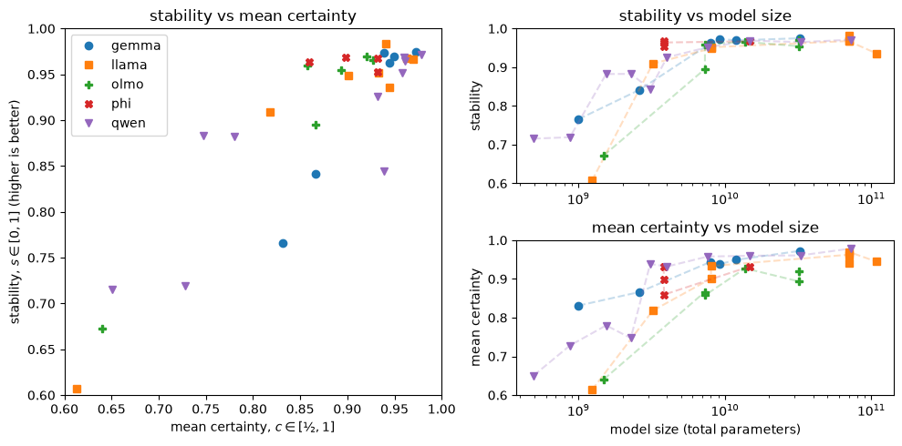

# Eliciting LLM Beliefs — And Why Model Size Matters

This repository contains the research code of
**[LLMs Can Reliably Tell You What They Believe — But Size Matters](https://cscheffler.github.io/garden/projects/eliciting-llm-beliefs-writeup)**.

## Project Summary

An honest LLM is one that accurately states its beliefs and acts consistently with its beliefs.
To do honesty research, we need to know what these models believe and we often do that by asking them.
Here we measure whether a model's stated yes/no probabilities stay the same when we change how we ask a factual question.
This is indirect evidence about the internal belief states of the model and we do not attempt to measure those internal states directly.

Models can vary wildly in the stability of their belief statements when the prompt is changed.
For honesty research, we need stable models — models that assign the same probability to the truth value of a claim when prompted in different ways.

The results show that model size really matters.
So, if you're an AI safety researcher and you rely on small open weights models for your work, beware!
You should first check that the model is capable of doing what you need it do to (for me: have stable belief statements) before using it for your research.



**Figure: Stability, certainty, and model size.**
We ask the model the same factual yes/no question with different prompts and compute the probability of a "Yes" response for all prompts.
Certainty is defined as the mean probability of saying either "yes" or "no", whichever is more likely.
Stability is defined in terms of the correlation of $P(\text{yes})$ between different prompt templates.
Larger models tend to have more stable "yes" response probabilities and to be more certain about their responses.

For AI honesty research, we suggest stability > 0.96 as a target since this is where the metric plateaus.
Models above this level are mostly indistinguishable on prompt consistency.
Values between 0.90 and 0.96 may be adequate for many purposes, but it's worth checking the correltaion details first — see the [Metrics section in the write-up](https://cscheffler.github.io/garden/projects/eliciting-llm-beliefs-writeup#metrics).
Below 0.9, treat the model's elicited probabilities as unreliable.
See [Table 3 in the write-up](https://cscheffler.github.io/garden/projects/eliciting-llm-beliefs-writeup#table-complete-results) for the full list of models ordered by stability.

## In This Repository

- `elicit-model-beliefs.ipynb`
  Main experiment.
  Loads each model, runs the dataset through it, and saves the first-token logits to disk.
- `all-figures.ipynb`
  Loads the saved results, computes the metrics, and produces the figures and the results table.
- `supporting_code.py`
  Shared logic: data loading, prompt templates, model loading, logit extraction, and metric computation.
- `requirements.txt`
  Python dependencies.
- `pip-freeze.txt`
  The package versions used for the published run.
  The requirements file pins package names but not versions.

## Reproducing the Results

### 1. Environment

The code was tested with **Python 3.12, PyTorch 2.8.0, and CUDA 12.8** on various NVIDIA GPUs.

See `requirements.txt` for dependencies and `pip-freeze.txt` for the package versions used in the published results.

### 2. Hugging Face Access

Some of the models (especially Llama and Gemma) are gated and require a Hugging Face account that has accepted each model's license.
Set your access token in the environment before running:

```bash
export HF_TOKEN="hf_..."
```

### 3. Dataset

True/False claims come from the **[Azaria & Mitchell True-False dataset](https://huggingface.co/datasets/notrichardren/azaria-mitchell)** (~13.7k statements across 12 topics, each labelled true or false).
It is downloaded automatically from the Hugging Face Hub the first time you run the experiment.
For this experiment, we don't need the true/false labels since we are measuring what the model believes rather than whether it is correct or not.

### 4. Run the Experiment

Open `elicit-model-beliefs.ipynb` and run the cells. The notebook:

1. Loads and expands the dataset — each true/false claim becomes 8 prompts.
2. Iterates over a list of Hugging Face model IDs, running each one and saving its results to `results/elicit-beliefs-<model-slug>.pt`.

Models are grouped by size into lists (`model_ids_20gb`, `model_ids_24gb`, ...) so each group can be run on an appropriately-sized GPU.
The size groups are labelled with the RunPod GPU tier and approximate hourly prices at the time of running the experiments.
These are just for guidance.
Any GPU with enough memory will do.

#### Compute Cost

A full sweep through the models, using different GPUs matching the model sizes as noted above, used approximately \$80 in RunPod credit and approximately 20 compute-hours in total.
This includes some failed runs and other error conditions and should be taken as approximate guidance only.

### 5. Figures and Tables

`all-figures.ipynb` reads every `results/*.pt` file, computes the metrics, and generates:

- belief stability vs certainty, and each of those vs model size (the headline figure above);
- token leakage vs. model size, where leakage is the amount of probability mass not assigned to the `yes` and `no` or `true` and `false` tokens;
- the sorted results table;
- correlation matrices, certainty and standard deviation histograms for each model.

#### Model Size Data

The model parameter counts used on the x-axis are hard-coded in a dictionary in `all-figures.ipynb`; add an entry there if you run a model that isn't already listed.

These numbers were pulled from Hugging Face using:

```python
from huggingface_hub import model_info

# One model
info = model_info("microsoft/Phi-4-mini-instruct")
print(info.safetensors)         # total and per-dtype breakdown
print(info.safetensors.total)   # total parameters only

# List of models
model_ids = ["microsoft/Phi-4-mini-instruct", ...]
model_sizes = {}
for model_id in model_ids:
    info = model_info(model_id)
    model_sizes[model_id] = info.safetensors.total
```

## License

Released under the [MIT License](LICENSE).
