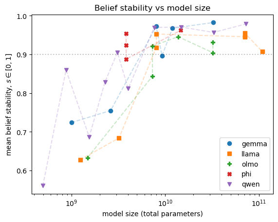

# Eliciting LLM Beliefs — and Why Model Size Matters

This repository contains the research code of
**[LLMs Can Tell You What They Believe — But Size Matters](https://cscheffler.github.io/garden/projects/eliciting-llm-beliefs-writeup)**.

## Project Overview

For AI honesty research, we want to know if we can trust an LLM's true/false answer to a factual claim.
A model's stated belief is only useful if it is *stable* — that is, if the model gives the same answer when the same question is phrased in slightly different ways.
This experiment measures that yes/no stability across a range of open-weight models and shows that it depends strongly on model size (and family).



**Figure 1: Belief stability vs model size.**
We ask the model the same factual yes/no question with different prompts and compute the probability of a "Yes" response for all prompts.
Belief stability is defined in terms of the standard devation of $p_{\text{yes}}$ across all prompts for the same factual question, $s = 1 - 2\,\mathrm{SD}(p_{yes}) \in [0, 1]$.

### Main Results and Takeaways

- Before building research work on a small model, check that it actually has the capability you need.
- Belief stability rises with model size, but family matters too.
  Large models (>7B parameters) are reliably stable ($s > 0.92$).
  The smallest models (<3B) are often too inconsistent to tell us anything useful about what they believe.
- The best performers reach $s ≈ 0.98$, for example, Gemma, Qwen2.5, Phi-4 at the larger sizes.

The full discussion, the headline figure, and the per-model results table are in the **[write-up](https://cscheffler.github.io/garden/projects/eliciting-llm-beliefs-writeup)**.

## In This Repository

- `elicit-model-beliefs.ipynb`
  Main experiment.
  Loads each model, runs the dataset through it, and saves the first-token logits to disk.
- `present-figure-1.ipynb`
  Loads the saved results, computes the metrics, and produces the figures and the results table.
- `supporting_code.py`
  Shared logic: data loading, prompt templates, model loading, logit extraction, and metric computation.
- `requirements.txt`
  Python dependencies.
- `pip-freeze.txt`
  The package versions used for the published run.
  The requirements file pins package names but not versions.

## Reproducing The Results

### 1. Environment

The code was tested with **Python 3.12, PyTorch 2.8.0, and CUDA 12.8** on various NVIDIA GPUs.

See `requirements.txt` for dependencies and `pip-freeze.txt` for the package versions used in the published results.

### 2. Hugging Face Access

Some of the models (especially Llama and Gemma) are gated and require a Hugging Face account that has accepted each model's license.
Set your access token in the environment before running:

```bash
export HF_TOKEN="hf_..."
```

### 3. Dataset

True/False claims come from the **[Azaria & Mitchell True-False dataset](https://huggingface.co/datasets/notrichardren/azaria-mitchell)** (~13.7k statements across 12 topics, each labelled true or false).
It is downloaded automatically from the Hugging Face Hub the first time you run the experiment.
For this experiment, we don't need the true/false labels since we are measuring what the model believes rather than whether it is correct or not.

### 4. Run The Experiment

Open `elicit-model-beliefs.ipynb` and run the cells. The notebook:

1. Loads and expands the dataset — each true/false claim becomes 8 prompts.
2. Iterates over a list of Hugging Face model IDs, running each one and saving its results to `results/elicit-beliefs-<model-slug>.pt`.

Models are grouped by size into lists (`model_ids_20gb`, `model_ids_24gb`, ...) so each group can be run on an appropriately-sized GPU.
The size groups are labelled with the RunPod GPU tier and approximate hourly prices at the time of running the experiments.
These are just for guidance.
Any GPU with enough memory will do.


#### Compute Cost

A full sweep through the models, using different GPUs matching the model sizes as noted above, used approximately $80 in RunPod credit and approximately 20 compute-hours in total.
This includes some failed runs and other error conditions and should be taken as approximate guidance only.

### 5. Figures and Tables

`present-figure-1.ipynb` reads every `results/*.pt` file, computes the metrics, and generates:

- certainty vs. model size,
- belief stability vs. model size (the headline figure),
- token leakage vs. model size, and
- the sorted results table.

#### Model Size Data

The model parameter counts used on the x-axis are hard-coded in a dictionary in `present-figure-1.ipynb`; add an entry there if you run a model that isn't already listed.

These numbers were pulled from Hugging Face using:

```python
from huggingface_hub import model_info

# One model
info = model_info("microsoft/Phi-4-mini-instruct")
print(info.safetensors)         # total and per-dtype breakdown
print(info.safetensors.total)   # total parameters only

# List of models
model_ids = ["microsoft/Phi-4-mini-instruct", ...]
model_sizes = {}
for model_id in model_ids:
    info = model_info(model_id)
    model_sizes[model_id] = info.safetensors.total
```

## License

Released under the [MIT License](LICENSE).
